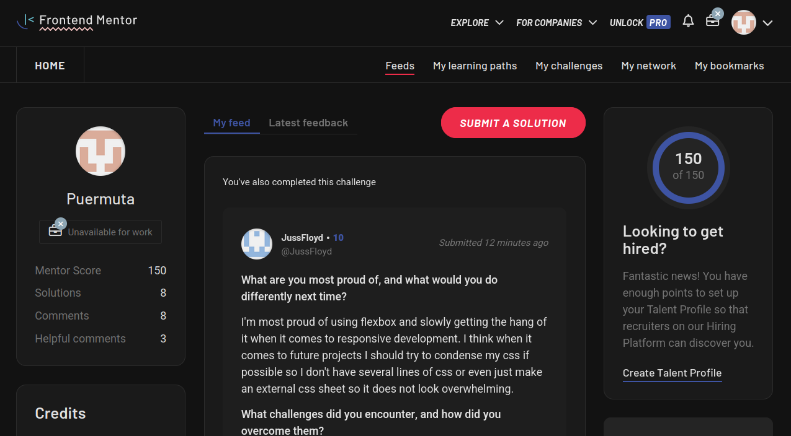

# Dark Mode for Frontend Mentor
Simple web extension to make Frontend Mentor dark mode. Developed for Firefox, but should also work for chromium-based browsers like Chrome, Edge and Opera.

### Preview



### How I made it
I used devtools to find the variables controlling the color of elements, and changed the various color properties to a darker tone. 
#### Example: 
```CSS
body, .bg-neutralOffWhite {
  background-color: #121212 !important;
  color: #e0e0e0 !important;
}
```
Because the page is written using Tailwind, I had to change the properties of the classes like ```.bg-neutralOffWhite``` (Which is not off-white anymore). Changing the color theme of the page is done in the file ```dark.css```. 

### Logo Replacement with MutationObserver

The script in `inject.js` uses a `MutationObserver` to dynamically detect and replace a specific logo image on the page (`logo-desktop.svg`) with a custom dark-mode version included in the extension.

- The script listens for DOM mutations on the entire document.
- When the target `` is detected:
  - It is replaced with a new `` element pointing to `assets/dark-logo.svg`.
  - The new image preserves the original's class, width, and height.
  - A `replaced` class is added to prevent repeated replacements.

This approach ensures compatibility with SPAs and dynamic content loading, which might be needed since the page is built on Next.js. It was also fun to experiment with.